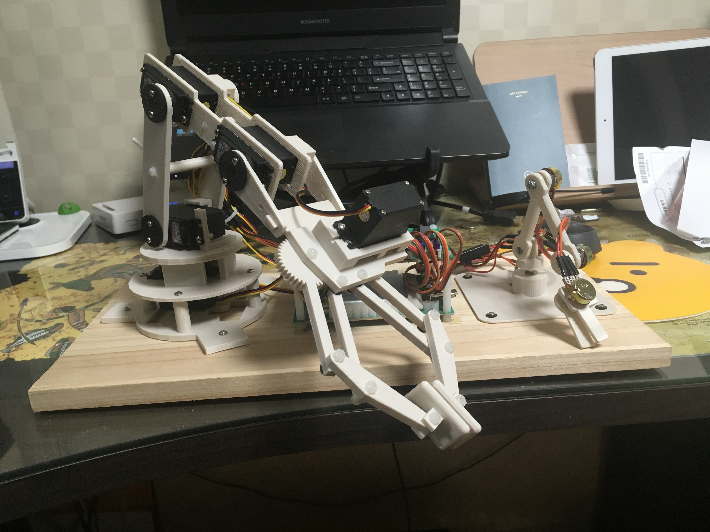

# Overview

This project involves controlling a robotic arm using the ATmega128P microcontroller. The robotic arm system consists of a Master Arm and a Slave Arm, each driven by 4 motors and 4 potentiometers. The system supports two modes of operation.

# Features

1. Remote Mode
In this mode, the Slave Arm follows the movement of the Master Arm in real-time. When the user moves the Master Arm, the Slave Arm performs the same motion.

2. Record Mode
In this mode, the movements of the Slave Arm are recorded and can be replayed. After moving the Slave Arm to the desired position, the motion is saved, and pressing the playback button will make the Master Arm perform the recorded movements.

# Hardware Configuration

- ATmega128P Microcontroller

- 4 servo motors (for slave)
- 4 potentiometers (for master)

# Software Configuration

- ATmega128P firmware (C/C++)

- Serial communication for data transmission

- Motor control algorithms

- Data storage and playback functionality

# Installation and Operation

1. Upload the firmware to the ATmega128P.
2. Select the desired mode to control the robotic arms:

   - **Remote Mode:** The Slave Arm mimics the movements of the Master Arm.

   - **Record Mode:** The Slave Arm's movements are recorded, and later played back on the Master Arm.

# Demo Video

- remote mode
   - https://www.youtube.com/shorts/-W-gj6TkzW4
- record & play
   - https://www.youtube.com/shorts/a9sSb8NWltA
   - https://www.youtube.com/shorts/P6XdI0nHfFc
